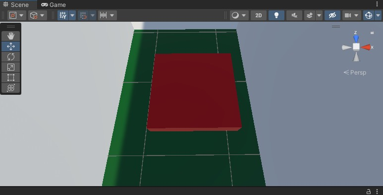

# ColisoresUnity
## Autores
Filipe Custodio Gonçalves e Gabriele Batista Sousa

## Descrição
Esse é um trabalho solitado em aula solitado pela orientadora Aline Firmino, com objetivo de utilizar tipos diferentes de colisores.

# Pesquisa sobre colisores:

* __Static Collider__:
O `Static Collider` é um componente em um GameObject que define uma área de colisão, mas não possui um Rigidbody associado. Eles são adequados para objetos que compõem a geometria do cenário e permanecem imóveis durante o jogo. Quando outros objetos com Rigidbody colidem com um Static Collider, não há transferência de forças, e o Collider estático serve principalmente como um obstáculo fixo.

* __Rigidbody Collider__:

O `Rigidbody Collider` é um GameObject que combina um Collider com um Rigidbody. Essa combinação permite simular a física realista, pois você aplica forças e torques ao Rigidbody para mover o objeto. É ideal para objetos que precisam de simulações físicas, como personagens, veículos e objetos que respondem à gravidade e às forças do ambiente.

* __Kinematic Rigidbody Collider__:

O `Kinematic Rigidbody` Collider é semelhante ao Rigidbody Collider, mas com uma distinção importante: o Rigidbody é marcado como IsKinematic. Isso significa que você controla o movimento do objeto diretamente, modificando seu componente Transform, em vez de aplicar forças. Esses colisores são úteis para objetos que precisam de interações físicas controladas, como portas ou plataformas móveis.

* __Static Trigger Collider__:

O `Static Trigger Collider` é semelhante ao Static Collider, mas é configurado para agir como um gatilho. Quando outros objetos entram na área do gatilho, ele pode acionar eventos de script sem causar uma colisão física. É útil para ativar ações específicas quando objetos entram em uma zona específica, como acionar cutscenes ou marcar pontos em um jogo.

* __Rigidbody Trigger Collider__:

O `Rigidbody Trigger Collider` é semelhante ao Rigidbody Collider, mas também é configurado como um gatilho. Quando outros objetos entram na área do gatilho, ele pode desencadear eventos de script, permitindo interações baseadas em eventos sem envolver colisões físicas diretas. Isso é útil em situações em que você deseja detectar eventos de colisão sem aplicar forças físicas.

* __Kinematic Rigidbody Trigger Collider__:

O `Kinematic Rigidbody Trigger Collider` combina as características do Kinematic Rigidbody Collider com a capacidade de agir como um gatilho. Isso significa que o objeto pode ser movido diretamente com seu Transform e, ao mesmo tempo, disparar eventos de script quando outros objetos entram na área do gatilho. É eficaz para situações em que você precisa de controle total sobre as interações físicas e eventos baseados em colisões.

# Desenvolvimento do projeto
aqui fica o processo de desenvolvimento
 
 

## Requisitos para instalação
Para ver a cena é necessario o Unity com versão `2021.3.6f1`

## Instalação
1. Clonar o projeto `https://drive.google.com/file/d/10r5fIHSmw27BPhso82r9C4f91-8dO5Hg/view?usp=sharing`
2. Abrir o projeto no Unity.

## Desenvolvimento 
Para criar esse projeto foi feito os seguintes passos:
1. Montar o labirinto com as paredes contentedo __Static Colider__:
 

3. Colocar o jogador que vai ser programado com __RigidBody collider__:
 

4. Criar o prefab da flecha para colidir com o personagem utilizando __Kinematic RigidBody Collider__:
 

5. Criar placa de pressão para instanciar a flecha em contato com o jogador considerando o __Static Trigger Collider__:
 

6. Adicionar pontos de verificação de checkpoint com um __RigidBody Trigger Collider__:
  

7. Criar portas com cores diferentes ligadas a botões(placas coloridas) __Kinematic RigidBody Collider__:
  
 

## demonstração 
